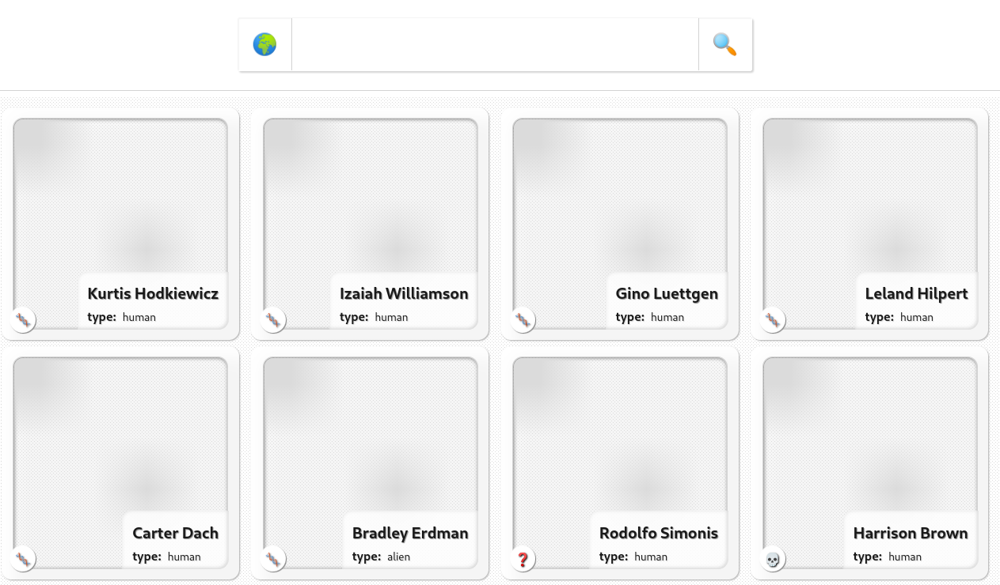

## Cartoon Catalog

A React/Redux based application which demonstrates a styled card layout with search filtering.

[Demo](https://arizonatribe.github.io/cartoon-catalog/)



## Usage

Filter cartoon characters using the search box. Once you begin typing, you'll see a list of fictional-ish locations where some of these characters reside.

Any one character will be visible in a card on the main page and you can click their picture to view additional details (or to add any notes).

Note: you can search by location or search by character name by toggling the search type button from 🌍 to 👤


## Dependencies

If you wish to clone and run this project locally, there are two required system dependencies:

* [Node](https://nodejs.org/en/)
* [Yarn](https://yarnpkg.com) - Install via `npm install -g yarn` after Node has been installed

## Patterns being demonstrated

As this project is a simple exercise, it is important to demonstrate several qualities which will work equally well when scaled out to something larger or just duplicated into an app of similar size to one.

#### Idiomatic

Can we have the benefits of the modern web yet stay relatively close to native HTML, CSS and JavaScript?

* Using native CSS styling carved up into small chunks named after the component in which they are being used
* Mixing CSS class names dynamically - based on user interaction - by importing those CSS files as modules (thanks to the mix of webpack loaders in place) and composing them in a JSON-like syntax via the [classnames](https://www.npmjs.com/package/classnames) tool.
* React offers a light abstraction layer over the DOM APIs (light enough that it doesn't disable your intuitions into how those underlying APIs function)
* There are no non-native HTML bindings to learn and interpolating is done simply through JavaScript inside of curly brace `{}` placeholders
* React makes it easier to write high-performance JavaScript, and is more true to the Lisp/Scheme/SmallTalk design patterns which birthed JavaScript
* React allows for an "HTML-like" syntax with __JSX__

#### Light Dependency Graph

The project itself is built with only the follow production dependencies (ie, the third-party dependencies which are bundled into the deployed app):

* [React](https://www.npmjs.com/package/react) & [React-DOM](https://www.npmjs.com/package/react-dom)
* [React-Redux](https://www.npmjs.com/package/react-redux) & [Redux Toolkit](https://www.npmjs.com/package/@reduxjs/toolkit)
* [React-Router](https://www.npmjs.com/package/react-router) & [React Router DOM](https://www.npmjs.com/package/react-router-dom)
* [Classnames](https://www.npmjs.com/package/classnames)

All these tools share these qualities in common:

* Are well-supported
* Are MIT-licensed
* Are heavily used (1M+ to 15M weekly downloads)
* Have long histories as open-source projects (except for Redux toolkit, they are all 7 to 10 years old)
* Are battle-tested at-scale (Slack, Facebook, Instagram, etc.)

Although it is common to leverage third-party component libraries and small tools, many of these components can be built by hand. Third-party components are written to cover a broader range of use-cases, and so they contain much more code and you do have to adapt your application to fit their API.

If you custom-fit components yourself, there are advantages vs disadvantages which you have weigh and see if the benefits outweigh the cost. Third-party components encapsulate a level of complexity you're often able to avoid, but it can be a rewarding scenario when you find the solution you built actually improves upon a popular third-party tool.

For the purpose of this project, the search/autocomplete, infinite scroll, cards, and card gallery were built by-hand (with some carryover from a few referenced blogs). Additionally, CSS grids were heavily used to create a minimal CSS flexible & responsive layout.

#### High Performance

JavaScript is fast and - thanks to the continued work on the V8 and Chakra projects - it only gets faster every year. Yet JavaScript applications can often perform poorly. Why is that?

JavaScript was created (intentionally) to be informal and this has allowed our community to explore a myriad of patterns and experiment on whether patterns transpose well from other languages. And although you can make it look like anything you want it to (thanks to frameworks and the many compile-to-JS supersets out there), not every practice is a best practice (nor is every design pattern a good one).

It is often disappointing when you see a pattern/practice perform beautifully in Java/C#/Elm/Haskell/OCaml yet perform poorly in JavaScript. Sometimes this leads to "cognitive dissonance" as we software engineers try to protect our personal comfort and reduce our own personal cognitive overload.

There are several great resources to help explore these concepts 

* [High Performance JavaScript](https://www.amazon.com/High-Performance-JavaScript-Application-Interfaces-ebook/dp/B0043D2F62)
* [JavaScript At Scale](https://www.amazon.com/JavaScript-at-Scale-Adam-Boduch/dp/1785282158)
* [Async and Performance](https://www.amazon.com/You-Dont-Know-JS-Performance/dp/1491904224)

Additionally, you can leverage [benchmark.js](https://www.npmjs.com/package/benchmark) to test your intuitions against reality. I went down that road a few years ago trying to explore a couple of micro-topics ("is it always bad to create variables in loops?" and "is `class` in JavaScript slower than object composition?"[[1]](https://github.com/arizonatribe/vanillas/blob/master/benchmark/classMemoryTest.js)[[2]](https://github.com/arizonatribe/vanillas/blob/master/benchmark/tests/class.js)). Similarly there are heap snapshots and memory profiling tools built into the browser developer tools.

To fine-tune this small application for performance, the following steps were taken:

* Using memoization for Redux store selectors
* Limiting the creation of functions inside the React component render function (to only those functions leveraging local variables or wrapped in "hooks")
* Reducing the amount of JavaScript being written which can be accomplished using CSS 
* The GraphQL queries sent to the external API names only search match IDs and counts, meaning very light payloads sent back
* Caching is in place and the Redux store is structured to optimistically update and not waste calls to the external RESTful/GraphQL APIs if not needed
* Prefetching items to send into the auto-completion textbox
* The more the app is used, the deeper the cache gets and the quicker each ensuing operation becomes

## Running it Locally

Although it's hosted on [Github pages](https://arizonatribe.github.io/cartoon-catalog) you can also clone and run this application locally.

After cloning it, just install the local dependencies:

```
yarn install
```

Once they've been installed into the `node_modules` directory, you can run the application:

```
yarn start
```

Now, navigate to [http://localhost:3000](http://localhost:3000) to interact with the application.

## Mock Environment

This exercise makes use of the following two API URLs which are free to use (but not abuse):

* [Rick and Morty API](https://rickandmortyapi.com/graphql)
* [Json Placeholder API](https://jsonplaceholder.typicode.com)

The base URLs are set in the [`.env`](.env) file included in this project:

```
REACT_APP_RICK_AND_MORTY_API=https://rickandmortyapi.com/graphql
REACT_APP_JSON_PLACEHOLDER_API=https://jsonplaceholder.typicode.com
```

## Resources Used

A few articles and reference docs were indispenable in creating this project:

* [React docs](https://reactjs.org/docs/getting-started.html)
* [Redux docs](https://react-redux.js.org/introduction/getting-started)
* [Redux Toolkit docs](https://redux-toolkit.js.org/introduction/getting-started)
* [Mozilla Developer Network docs](https://developer.mozilla.org/en-US/)
* [Setting up a CI/CD workflow on Github actions for a React app](https://dev.to/dyarleniber/setting-up-a-ci-cd-workflow-on-github-actions-for-a-react-app-with-github-pages-and-codecov-4hnp)
* [Simple CSS loading spinner](https://dev.to/dcodeyt/create-a-button-with-a-loading-spinner-in-html-css-1c0h) - final solution has about 60%? carryover from the one built in this article
* [Build a React autocomplete component from scratch](https://blog.logrocket.com/build-react-autocomplete-component/) - final solution has about 30% carryover from the one built in this article
* [Implementing Infinite Scroll and Image Lazy Loading in React](https://www.smashingmagazine.com/2020/03/infinite-scroll-lazy-image-loading-react/) - intersection observer hook has about 70-80% carryover from the one built in this article
